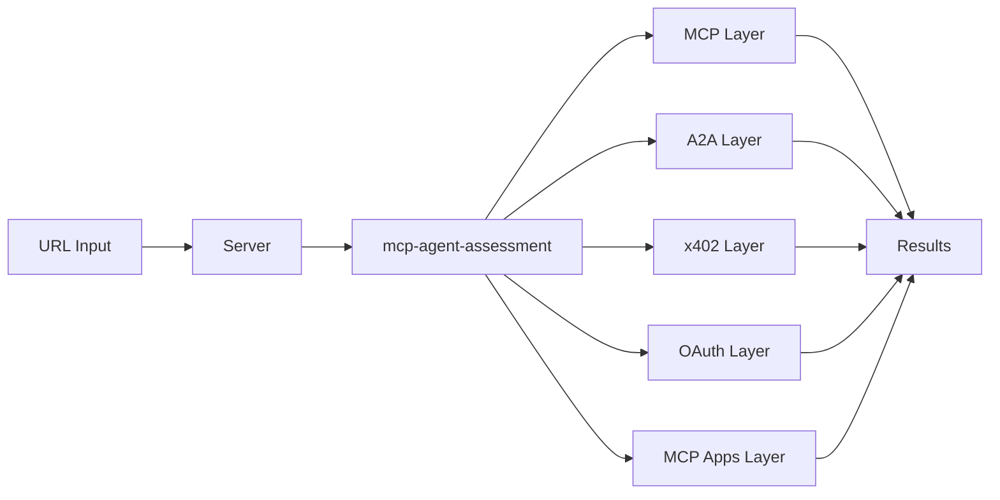

[](https://github.com/FlowMCP/mcp-agent-validator/actions) 

# MCP Agent Validator

Web-based multi-protocol validator for AI agent endpoints. Enter a URL and get instant validation results for MCP, A2A, x402, OAuth, and MCP Apps.

## Architecture



## Quickstart

```bash
git clone https://github.com/FlowMCP/mcp-agent-validator.git
cd mcp-agent-validator
npm install
npm run start:dev
```

Open `http://localhost:4000` in your browser and enter an endpoint URL to validate.

## API

### `POST /api/validate`

Returns a structured validation result with separate sections for each protocol.

```bash
curl -X POST http://localhost:4000/api/validate \
  -H 'Content-Type: application/json' \
  -d '{"url": "https://your-endpoint.example.com"}'
```

**Response** contains `mcp`, `a2a`, `ui` (MCP Apps), and `oauth` objects with `status`, `categories`, `summary`, and `messages`.

### `POST /api/assess`

Returns the raw assessment result from `mcp-agent-assessment` with full layer details.

```bash
curl -X POST http://localhost:4000/api/assess \
  -H 'Content-Type: application/json' \
  -d '{"url": "https://your-endpoint.example.com"}'
```

Optional parameters: `timeout` (number, ms), `erc8004` (object with `rpcNodes`).

## Authentication

Authentication is optional. When `API_TOKEN` is not set, the API is open (dev mode).

When `API_TOKEN` is set, two authentication methods are supported:

| Method | How it works |
|--------|-------------|
| **Session Cookie** | Browser visits `GET /` and receives a session cookie automatically. All subsequent API calls from the browser include the cookie. |
| **Bearer Token** | External scripts send `Authorization: Bearer <API_TOKEN>` header. |

```bash
# With Bearer token
curl -X POST http://localhost:4000/api/validate \
  -H 'Content-Type: application/json' \
  -H 'Authorization: Bearer your-token-here' \
  -d '{"url": "https://your-endpoint.example.com"}'
```

## Environment Variables

| Variable | Required | Default | Description |
|----------|----------|---------|-------------|
| `PORT` | No | `4000` | Server port |
| `API_TOKEN` | No | - | When set, enables authentication for API endpoints |

## Project Structure

```
src/
├── server/
│   ├── Server.mjs          # HTTP server, routing, auth, API handlers
│   └── StaticFiles.mjs     # Static file serving for docs/
docs/
├── index.html              # Single-page frontend
└── style.css               # Styles
tests/
└── unit/
    ├── server.test.mjs     # Server route, auth, and API tests
    ├── static-files.test.mjs
    └── assessment-probe.test.mjs
```

## Dependencies

- [mcp-agent-assessment](https://github.com/FlowMCP/mcp-server-assessment) - Unified 4-layer assessment pipeline (MCP, A2A, x402, OAuth, MCP Apps)

## License

MIT
