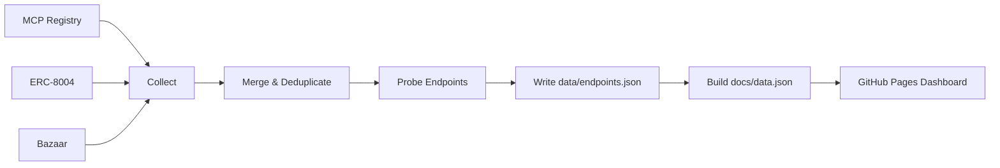

[](https://github.com/FlowMCP/x402-mcp-monitor/actions) 

# x402 MCP Monitor

Monitors x402-capable MCP servers across three registries and publishes a live dashboard.

## What it does

Every 6 hours, this tool:

1. **Collects** endpoint URLs from MCP Registry, ERC-8004 on-chain registry, and Coinbase Bazaar
2. **Merges** them into a single, deduplicated list (same URL from multiple sources = one entry with multiple source tags)
3. **Probes** each endpoint to check reachability, tool availability, and x402 payment support
4. **Publishes** results as a static GitHub Pages dashboard

## Architecture



## Quickstart

```bash
git clone https://github.com/FlowMCP/x402-mcp-monitor.git
cd x402-mcp-monitor
npm install
```

Run a collection cycle locally:

```bash
ALCHEMY_API_KEY=your_key node src/index.mjs
```

Run tests:

```bash
npm test
```

## Data Model

All endpoints live in a single file: `data/endpoints.json`

```json
{
    "version": 1,
    "updatedAt": "2026-02-04T12:00:00.000Z",
    "stats": {
        "total": 520,
        "reachable": 210,
        "withX402": 15
    },
    "endpoints": [
        {
            "id": "ep_a1b2c3d4",
            "url": "https://mcp.example.com/mcp",
            "protocol": "mcp",
            "sources": [
                { "type": "mcp-registry", "serverName": "io.github.user/weather" },
                { "type": "erc8004", "agentId": "42" }
            ],
            "probe": {
                "status": true,
                "categories": { "isReachable": true, "supportsX402": true },
                "summary": { "toolCount": 5, "x402ToolCount": 3 }
            }
        }
    ]
}
```

Each endpoint carries its discovery source(s) as tags and the latest probe result.

## Sources

| Source | What it provides |
|--------|-----------------|
| [MCP Registry](https://registry.modelcontextprotocol.io) | Registered MCP servers with remote transport URLs |
| [ERC-8004](https://eips.ethereum.org/EIPS/eip-8004) | On-chain agent registry (Ethereum mainnet) with MCP/A2A endpoints |
| [Coinbase Bazaar](https://docs.cdp.coinbase.com/x402/bazaar) | x402-compatible paid API resources |

## Environment Variables

| Variable | Required | Default | Description |
|----------|----------|---------|-------------|
| `ALCHEMY_API_KEY` | Yes | - | Alchemy API key for ERC-8004 on-chain queries |
| `PROBE_MAX_AGE_DAYS` | No | `7` | Endpoints probed within this period are skipped |
| `PROBE_MAX_CONCURRENCY` | No | `5` | Max concurrent probes |
| `PROBE_TIMEOUT_MS` | No | `15000` | Probe timeout per endpoint |

## Project Structure

```
src/
├── index.mjs                    # Entry point
├── Monitor.mjs                  # 6-phase pipeline orchestrator
├── collector/
│   ├── McpRegistryCollector.mjs # REST pagination of MCP Registry
│   ├── Erc8004Collector.mjs     # eth_getLogs + Erc8004RegistryParser
│   └── BazaarCollector.mjs      # REST pagination of Bazaar discovery
├── prober/
│   ├── EndpointProber.mjs       # Rate-limited concurrent probing
│   ├── McpProbe.mjs             # McpServerValidator wrapper
│   └── A2aProbe.mjs             # A2aAgentValidator wrapper
├── registry/
│   ├── EndpointRegistry.mjs     # Merge, deduplicate, compute stats
│   └── EndpointNormalizer.mjs   # URL normalization + deterministic ID
├── state/
│   └── StateManager.mjs         # Read/write state.json + endpoints.json
├── writer/
│   ├── DataWriter.mjs           # Atomic JSON writes + history management
│   └── DashboardBuilder.mjs     # Build docs/data.json from endpoints
└── task/
    └── Validation.mjs           # Input validation for all public methods
```

## GitHub Actions

| Workflow | Trigger | Purpose |
|----------|---------|---------|
| `collect.yml` | Cron (every 6h) + manual | Run collection pipeline, commit results |
| `deploy.yml` | Push to `docs/` | Deploy dashboard to GitHub Pages |
| `test-on-push.yml` | Push | Run tests + upload coverage to Codecov |

## Dependencies

- [erc8004-registry-parser](https://github.com/FlowMCP/erc8004-registry-parser) - Parse ERC-8004 on-chain registry events
- [x402-mcp-validator](https://github.com/FlowMCP/x402-mcp-validator) - Validate MCP servers and detect x402 support
- [a2a-agent-validator](https://github.com/FlowMCP/a2a-agent-validator) - Validate Google A2A agents

## License

MIT
