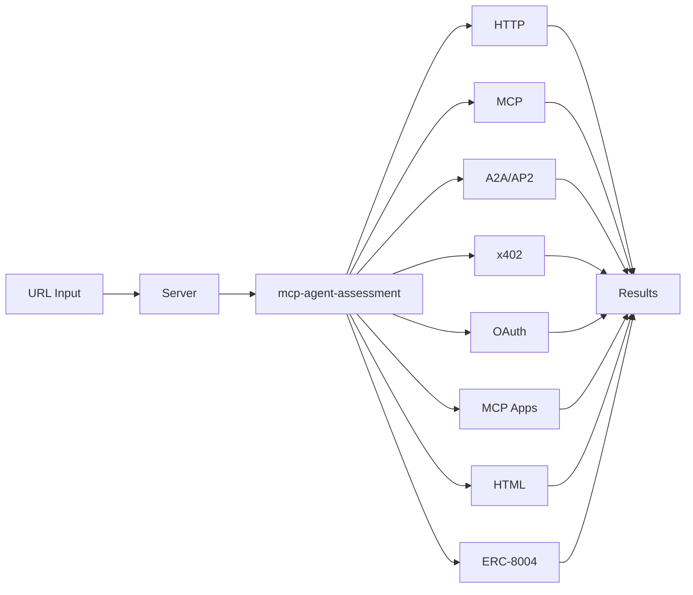

[](https://github.com/FlowMCP/mcp-agent-validator/actions) 


# AgentProbe (MCP Agent Validator)

Web-based multi-protocol validator for AI agent endpoints. Enter a URL and get instant assessment across eight protocol layers — HTTP, MCP, A2A/AP2, x402, OAuth, MCP Apps, HTML, and ERC-8004.

**Live demo:** https://agentprobe.xyz
**Video:** https://www.youtube.com/watch?v=gnmsCEly3fA
**DoraHacks:** https://dorahacks.io/buidl/39293

## TL;DR

- **Problem:** Agent endpoints are hard to validate across multiple evolving protocols.
- **Solution:** One URL → unified assessment across HTTP, MCP, A2A/AP2, x402, OAuth, MCP Apps, HTML, and ERC-8004.
- **Benefit:** Faster debugging, safer integrations, and clearer compliance signals.

## Demo


## Video (Thumbnail Template)


## Quickstart

```bash
git clone https://github.com/FlowMCP/mcp-agent-validator.git
cd mcp-agent-validator
npm install
npm run start:dev
```

Open `http://localhost:4000` in your browser and enter an endpoint URL to validate.

## How It Works

- **Input:** A single agent endpoint URL.
- **Assessment:** Server runs the `mcp-agent-assessment` pipeline with protocol-specific validators.
- **Output:** Unified verdicts per protocol layer plus raw assessment output.

## Features

- **MCP** — Server discovery, tool/resource/prompt listing, capability detection
- **A2A / AP2** — Agent card validation, Google Agent Payments Protocol (AP2) version and role detection via `capabilities.extensions` and `X-A2A-Extensions` header
- **x402** — Payment-required endpoint detection with scheme, network, and token analysis
- **OAuth 2.1** — Authorization server metadata discovery
- **MCP Apps** — UI resource detection for MCP applications
- **ERC-8004** — On-chain agent registry lookup with endpoint discovery, trust models, and metadata extraction
- **OASF** — Open Agent Schema Framework classification (skills and domains from [agntcy/oasf](https://github.com/agntcy/oasf))
- **Reputation** — On-chain reputation data via ERC-8004 `getMetadata`

## Architecture



## API

### `POST /api/validate`

Returns a structured validation result with separate sections for each protocol.

```bash
curl -X POST http://localhost:4000/api/validate \
  -H 'Content-Type: application/json' \
  -d '{"url": "https://your-endpoint.example.com"}'
```

**Response** contains `mcp`, `a2a`, `ui` (MCP Apps), and `oauth` objects with `status`, `categories`, `summary`, and `messages`. A2A results include AP2 version, roles, and extension URIs when detected.

### `POST /api/assess`

Returns the raw assessment result from `mcp-agent-assessment` with full layer details.

```bash
curl -X POST http://localhost:4000/api/assess \
  -H 'Content-Type: application/json' \
  -d '{"url": "https://your-endpoint.example.com"}'
```

Optional parameters: `timeout` (number, ms), `erc8004` (object with `rpcNodes`).

### `POST /api/lookup`

Query the ERC-8004 on-chain registry for agent registration data, endpoints, OASF classification, and reputation.

```bash
curl -X POST http://localhost:4000/api/lookup \
  -H 'Content-Type: application/json' \
  -d '{"agentId": 2340, "chainId": 8453}'
```

| Key | Type | Description | Required |
|-----|------|-------------|----------|
| agentId | number | Agent token ID in the ERC-8004 registry | Yes |
| chainId | number or string | Chain ID (e.g. `8453` for Base) or CAIP-2 (e.g. `eip155:8453`) | Yes |
| rpcNodes | object | Custom RPC nodes per chain alias | No |

## Authentication

Authentication is optional. When `API_TOKEN` is not set, the API is open (dev mode).

When `API_TOKEN` is set, two authentication methods are supported:

| Method | How it works |
|--------|-------------|
| **Session Cookie** | Browser visits `GET /` and receives a session cookie automatically. All subsequent API calls from the browser include the cookie. |
| **Bearer Token** | External scripts send `Authorization: Bearer <API_TOKEN>` header. |

```bash
# With Bearer token
curl -X POST http://localhost:4000/api/validate \
  -H 'Content-Type: application/json' \
  -H 'Authorization: Bearer your-token-here' \
  -d '{"url": "https://your-endpoint.example.com"}'
```

## Environment Variables

| Variable | Required | Default | Description |
|----------|----------|---------|-------------|
| `PORT` | No | `4000` | Server port |
| `API_TOKEN` | No | - | When set, enables authentication for API endpoints |

## Project Structure

```
src/
├── server/
│   ├── Server.mjs          # HTTP server, routing, auth, API handlers
│   └── StaticFiles.mjs     # Static file serving for docs/
├── mcp/
│   └── McpServer.mjs       # Built-in MCP server (validate, lookup, client introspection)
├── prober/
│   ├── AssessmentProbe.mjs  # Maps assessment results to UI-friendly format
│   └── AgentLookup.mjs     # Direct ERC-8004 on-chain registry queries
docs/
├── index.html              # Single-page frontend with OASF rendering
└── style.css               # Styles
tests/
└── unit/
    ├── server.test.mjs     # Server route, auth, and API tests
    ├── static-files.test.mjs
    └── assessment-probe.test.mjs
```

## Dependencies

- [mcp-agent-assessment](https://github.com/FlowMCP/mcp-server-assessment) — Unified assessment pipeline (MCP, A2A/AP2, x402, OAuth, MCP Apps)
- [a2a-agent-validator](https://github.com/FlowMCP/a2a-agent-validator) — A2A agent card and AP2 extension detection
- [x402-mcp-validator](https://github.com/FlowMCP/x402-mcp-validator) — x402 payment protocol validation
- [mcp-apps-validator](https://github.com/FlowMCP/mcp-apps-validator) — MCP Apps UI resource detection
- [erc8004-registry-parser](https://github.com/FlowMCP/erc8004-registry-parser) — ERC-8004 on-chain registry parsing

## Built by

[a6b8](https://github.com/a6b8)

## License

MIT
